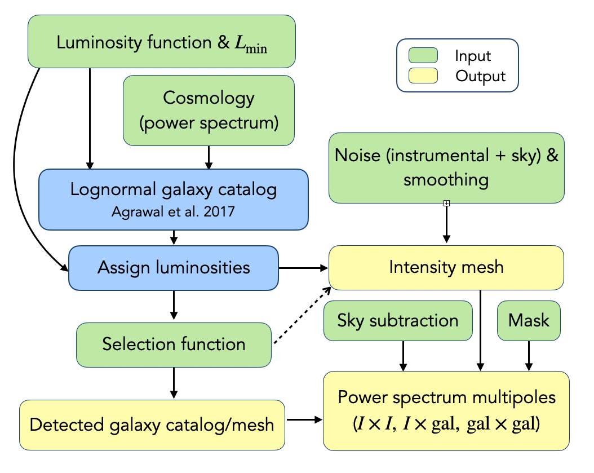

# Simple Intensity Map Producer for Line Emission (SIMPLE)

## Introduction

Thank you for considering to use the SIMPLE code for your intensity map mocks!

The Simple Intensity Map Producer for Line Emission (SIMPLE) is meant as a versatile tool to quickly generate intensity maps. It is introduced in this paper [link to the arxiv] and follows this basic pipeline:

The latest documentation can be found here: https://simple-intensity-mapping-simulator.readthedocs.io/en/latest/.

## Installation
1. Make sure you have a python environment with all the required packages (specified in the `environments.yaml` file.)
2. install intensity-mapping branch of lognormal_galaxies code from https://bitbucket.org/komatsu5147/lognormal_galaxies/src/master/:
      `git clone -b intensity-mapping https://bitbucket.org/komatsu5147/lognormal_galaxies/`
      and follow installation instructions.
3. clone this repo 
    `git clone https://github.com/mlujnie/simple`.
4. modify the `simple/config.py` file: change the path to the path of your lognormal_galaxies installation.
5. type `pip install .` in the root directory of this repo.

### add following information: 
* Brief description of features
* Usage (with examples)
* Build and install (with examples)
* Dependencies
    * python 3.8 (for pmesh)
    * cython
    * scipy
    * numpy
    * astropy
    * h5py
    * dask
    * pmesh
* Status of the code and how it is maintained
