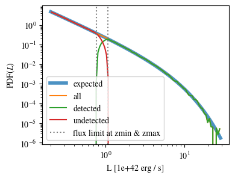
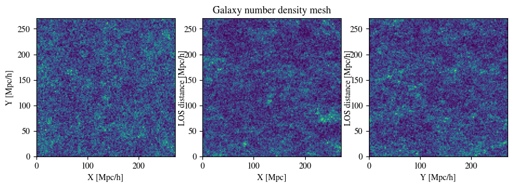

SIMPLE tutorial notebook
========================

.. code:: ipython3

    %load_ext autoreload
    %autoreload 2

.. code:: ipython3

    import matplotlib.pyplot as plt
    %matplotlib inline
    
    # update matplotlib params for bigger font
    import matplotlib.pylab as pylab
    params = {'mathtext.fontset': 'stix',
             'font.family': 'STIXGeneral'}
    pylab.rcParams.update(params)

.. code:: ipython3

    from simple.simple import LognormalIntensityMock

.. code:: ipython3

    from astropy.cosmology import Planck18 as cosmo
    import astropy.units as u
    import astropy.constants as const
    from astropy.table import Table
    
    import numpy as np
    import yaml
    import os
    
    from scipy.integrate import quad

Run manually
------------

Define the luminosity function
~~~~~~~~~~~~~~~~~~~~~~~~~~~~~~

The function has to be dimensionless, i.e. the input is given in units
of the defined ``luminosity_unit`` and the output will be in units of
:math:`\frac{1}{\mathrm{Mpc}^3\mathrm{luminosity\_unit}}`. It is best to
use a typical luminosity for ``luminosity_unit`` so that the numerical
errors of the integration will be small.

.. code:: ipython3

    luminosity_unit = 1e42 * u.erg / u.s
    
    def luminosity_function(L):
        """
        Calculates dn/dL (L), where L must be in units of luminosity_unit.
        For integration purposes, make sure that L/luminosity_unit is typically
        a small number, so that the numbers don't overflow in the integration.
        For example, luminosity_unit could be the mean expected luminosity.
    
        Luminosity function from Konno et al. (2016).
        """
        Lstar = (4.87 * luminosity_unit).to(luminosity_unit).value # 1e42 erg / s
        phistar = 3.37 * 1e-4 # Mpc-3
        alpha = -1.8
    
        return phistar * (L/Lstar)**alpha * np.exp(-L/Lstar) * 1/Lstar

We will save the luminosity function in a table so that we can later
initiate the ``LognormalIntensityMock`` instance from files.

.. code:: ipython3

    max_L_for_saving = 1e45 * u.erg / u.s
    Lmin = 1e40 * u.erg / u.s
    if np.isfinite(max_L_for_saving):
        max_log10_L_for_saving = np.log10(
            max_L_for_saving.to(luminosity_unit).value)
    else:
        max_log10_L_for_saving = np.log10((1e5 * Lmin).to(luminosity_unit).value)
    min_log10_L_for_saving = np.log10(Lmin.to(luminosity_unit).value)
    N_save = 10000
    dlog_10_L = (max_log10_L_for_saving - min_log10_L_for_saving) / N_save
    log_10_Ls = np.linspace(min_log10_L_for_saving, max_log10_L_for_saving, N_save)
    
    lum_tab = Table()
    lum_tab["L"] = 10**log_10_Ls
    lum_tab["dn/dL"] = luminosity_function(10**log_10_Ls)
    lum_tab.write("luminosity_function_example.csv",
                  format="csv", overwrite=True)

Set up input parameters
~~~~~~~~~~~~~~~~~~~~~~~

It is possible to initiate a ``LognormalIntensityMock`` instance from a
dictionary or from a yaml file that contains this dictionary.

.. code:: ipython3

    input_dict = {"verbose" : False,
                  "bias" : 1.5,
                  "redshift" : 2.0,
                  "single_redshift" : False,
                  "box_size" : np.array([400,400,400]) * u.Mpc,
                  "N_mesh" : np.array([128,128,128]),
                  "luminosity_unit" : luminosity_unit,
                  "Lmin" : 2e41 * u.erg/u.s,
                  "Lmax" : np.inf * u.erg/u.s,
                  "galaxy_selection" : {"intensity" : "all",
                                        "n_gal" : "detected"},
                  "lambda_restframe" : 1215.67 * u.angstrom,
                  "brightness_temperature" : False,
                  "do_spectral_smooth" : True,
                  "do_spectral_tophat_smooth" : False,
                  "do_angular_smooth" : True,
                  "sigma_beam" : 6 * u.arcsec,
                  "dlambda" : 5 * u.angstrom,
                  "footprint_radius" : 9 * u.arcmin,
                  "luminosity_function" : luminosity_function,
                  "run_pk" : {"intensity": True,
                            "n_gal": True,
                            "cross": True,
                            "sky_subtracted_cross": True
                                },
                  "dk" : 0.04,
                  "kmin" : 0.04,
                  "kmax" : 1.0,
                  "seed_lognormal" : 100,
                  "outfile_prefix" : 'mock',
                  "cosmology" : cosmo,
                  "RSD" : True,
                  "out_dir" : "../tmp/mocks/",
                  "min_flux" : 3e-17 * u.erg/u.s/u.cm**2,
                  "sigma_noise" : 2e-22 * u.erg/u.s/u.cm**2/u.angstrom/u.arcsec**2,
    }

Initiate the LognormalIntensityMock instance
~~~~~~~~~~~~~~~~~~~~~~~~~~~~~~~~~~~~~~~~~~~~

with the input dictionary:

.. code:: ipython3

    lim = LognormalIntensityMock(input_dict)

Or initiate the ``LognormalIntensityMock`` instance from a yaml file
that contains the input dictionary. In this case, the cosmology must be
specified in a file or a dictionary that can be evaluated by astropy to
construct a cosmology object or as a string that is part of the astropy
cosmology collection, such as ``Planck18``. The luminosity function also
has to be specified as the name of the file that contains the tabulated
luminosity function.

.. code:: ipython3

    lim = LognormalIntensityMock("example_input_file.yaml")

.. parsed-literal::

    2023-07-12 09:51:11,359 simple WARNING: We extrapolate the values outside of the provided tabulated values of L. 
    Plot plt.loglog(Ls, lim.luminosity_function(Ls)) in a reasonable range to check the outcome!

Run the lognormal galaxy simulation from lognognormal_galaxies and load the catalog:
~~~~~~~~~~~~~~~~~~~~~~~~~~~~~~~~~~~~~~~~~~~~~~~~~~~~~~~~~~~~~~~~~~~~~~~~~~~~~~~~~~~~

.. code:: ipython3

    lim.run_lognormal_simulation_cpp()
    lim.load_lognormal_catalog_cpp(
                    bin_filename=lim.lognormal_bin_filename)

.. parsed-literal::

    [0.   0.   0.06] eV
    {'ofile_prefix': 'mock', 'inp_pk_fname': '../tmp/mocks/inputs/mock_pk.txt', 'xi_fname': '../tmp/mocks/inputs/mock_Rh_xi.txt', 'pkg_fname': '../tmp/mocks/inputs/mock_pkG.dat', 'mpkg_fname': '../tmp/mocks/inputs/mock_mpkG.dat', 'cpkg_fname': '../tmp/mocks/inputs/mock_mpkG.dat', 'f_fname': '../tmp/mocks/inputs/mock_fnu.txt', 'z': 2.0, 'mnu': 0.06, 'oc0h2': 0.11934063901639999, 'ob0h2': 0.0224178568132, 'ns': 0.9645, 'lnAs': 3.094, 'h0': <Quantity 0.6766>, 'w': -1.0, 'run': 0.0, 'bias': 1.5, 'bias_mpkG': 1.0, 'bias_cpkG': 1.35, 'Nrealization': 1, 'Ngalaxies': 279657, 'Lx': 270.64000000000004, 'Ly': 270.64000000000004, 'Lz': 270.64000000000004, 'rmax': 10000.0, 'seed': 100, 'Pnmax': 128, 'losy': 0.0, 'losz': 0.0, 'kbin': 0.01, 'kmax': 0.0, 'lmax': 4, 'gen_inputs': True, 'run_lognormal': True, 'calc_pk': False, 'calc_cpk': False, 'use_cpkG': 0, 'output_matter': 0, 'output_gal': 1, 'calc_mode_pk': 0, 'out_dir': '../tmp/mocks/', 'halofname_prefix': '', 'imul_fname': '', 'num_para': 1, 'om0h2': 0.14175849582959998, 'om0': 0.30966, 'ob0': 0.04897, 'ode0': 0.6888463055445441, 'losx': 1.0, 'As': 2.2065162338947054e-09, 'aH': 100.27554429639554}
    dir_name:  ../tmp/mocks/
    ../tmp/mocks/rsd
    ../tmp/mocks/realspace
    dir_name:  ../tmp/mocks/inputs
    ../tmp/mocks/inputs/rsd
    ../tmp/mocks/inputs/realspace
    dir_name:  ../tmp/mocks/lognormal
    ../tmp/mocks/lognormal/rsd
    ../tmp/mocks/lognormal/realspace
    dir_name:  ../tmp/mocks/pk
    ../tmp/mocks/pk/rsd
    ../tmp/mocks/pk/realspace
    dir_name:  ../tmp/mocks/coupling
    ../tmp/mocks/coupling/rsd
    ../tmp/mocks/coupling/realspace
    time ~/Documents/projects/playground/lognormal_galaxies/eisensteinhubaonu/compute_pk ../tmp/mocks//inputs/mock 0.30966 0.6888463055445441 0.04897 0.6766 -1.0 0.9645 0.0 2.2065162338947054e-09 0.06 2.0
     Calculate the linear power spectrum using Eisenstein & Hu's transfer function
    time ~/Documents/projects/playground/lognormal_galaxies/compute_xi/compute_xi ../tmp/mocks/inputs/mock ../tmp/mocks/inputs/mock_pk.txt 1037
     read in ../tmp/mocks/inputs/mock_pk.txt
    time ~/Documents/projects/playground/lognormal_galaxies/compute_pkG/calc_pkG ../tmp/mocks/inputs/mock_pkG.dat ../tmp/mocks/inputs/mock_Rh_xi.txt 2 1.5 10000.0
    time ~/Documents/projects/playground/lognormal_galaxies/compute_pkG/calc_pkG ../tmp/mocks/inputs/mock_mpkG.dat ../tmp/mocks/inputs/mock_Rh_xi.txt 2 1.0 10000.0
    time ~/Documents/projects/playground/lognormal_galaxies/generate_Poisson/gen_Poisson_mock_LogNormal ../tmp/mocks/inputs/mock_pkG.dat ../tmp/mocks/inputs/mock_mpkG.dat 0 ../tmp/mocks/inputs/mock_mpkG.dat 270.64000000000004 270.64000000000004 270.64000000000004 128 279657 100.27554429639554 ../tmp/mocks/inputs/mock_fnu.txt 1.5 19094 60232 59629 ../tmp/mocks//lognormal/mock_lognormal_rlz0.bin ../tmp/mocks//lognormal/mock_density_lognormal_rlz0.bin 0 1
    -------------beginning generate_poisson---------------------
    Setting up the arrays.......
    n0,n1,n2=128	128	128
    size of Fourier grid is (n0,n1,n2)
    (128,128,128)
    Fourier resolution is 2.11438[Mpc/h]
    Lx 270.64
    Ly 270.64
    Lz 270.64
    kF0 0.023216
    Generating mock density field in k-space

.. parsed-literal::

    Note: The following floating-point exceptions are signalling: IEEE_UNDERFLOW_FLAG
    
    real	0m0.014s
    user	0m0.005s
    sys	0m0.004s
    
    real	0m0.033s
    user	0m0.026s
    sys	0m0.003s
    
    real	0m0.021s
    user	0m0.015s
    sys	0m0.004s
    
    real	0m0.022s
    user	0m0.015s
    sys	0m0.004s

.. parsed-literal::

    Finished generating mock density field.
    Doing FFT for density field.
    Done FFT for density field.
    Average of Log-normal density field  :-3.05271e-09
    Variance of Log-normal density field :1568.33
    Average of Log-normal density field  :-1.45565e-15
    Variance of Log-normal density field :1.08298
    Average of matter Log-normal density field :-4.62067e-10
    Variance of matter Log-normal density field :1197.7
    Average of matter Log-normal density field :-2.20331e-16
    Variance of matter Log-normal density field :0.82705
    density maximum = 153.52
    density minimum = -0.997805
    Average of density field: 0.00100348
    Variance of density field: 2.26557
    Doing FFT for the density field.
    Calculating velocity field in Fourier space...
    Doing FFT for the vx field.
    Doing FFT for the vy field.
    Doing FFT for the vz field.
    Initializing random generater..
    checkpoint 1
    Ngalaxies 279657
    checkpoint 2
    checkpoint 3
    checkpoint 4
    final_array_length 3355884
    checkpoint 5: allocated array.
    Generating Poisson particles...........
    ngalbar: 0.133351
    checkpoint 6: starting nested for loops.
    Total number of 279646 galaxies are generated!
    min[vx] = -1681.87	max[vx] = 1623.85
    avg[vx] = -0.427648	var[vx] = 51906.9
    min[vy] = -1658.54	max[vy] = 1473.81
    avg[vy] = 0.407441	var[vy] = 46194.3
    min[vz] = -1979.67	max[vz] = 1422.05
    avg[vz] = 0.207766	var[vz] = 57476.9
    Final nPoisson: 279646
    skip: calculate Pk
    Saving to ../tmp/mocks/lognormal/mock_lognormal_rlz0.h5
    Memory usage:  0.21370703125  GB.
    Edges of the galaxy coordinates:
    0.0001535299 270.63992
    0.0003810551 270.63953
    0.00022548073 270.6387
    Overwriting Position in ../tmp/mocks/lognormal/mock_lognormal_rlz0.h5.
    Overwriting Velocity in ../tmp/mocks/lognormal/mock_lognormal_rlz0.h5.
    Overwriting L_box in ../tmp/mocks/lognormal/mock_lognormal_rlz0.h5.
    Overwriting N_gal in ../tmp/mocks/lognormal/mock_lognormal_rlz0.h5.
    Saved to ../tmp/mocks/lognormal/mock_lognormal_rlz0.h5

.. parsed-literal::

    
    real	0m0.197s
    user	0m0.241s
    sys	0m0.021s

Assign the redshift
~~~~~~~~~~~~~~~~~~~

…along the LOS axis (0): ``lim.assign_redshift_along_axis()``.

If you want to assign a single redshift to the entire box, run
``lim.assign_single_redshift()``

.. code:: ipython3

    lim.assign_redshift_along_axis()

Assign a luminosity to each galaxy following the luminosity function
~~~~~~~~~~~~~~~~~~~~~~~~~~~~~~~~~~~~~~~~~~~~~~~~~~~~~~~~~~~~~~~~~~~~

.. code:: ipython3

    lim.assign_luminosity()

convert the luminosity to the flux
~~~~~~~~~~~~~~~~~~~~~~~~~~~~~~~~~~

.. code:: ipython3

    lim.assign_flux()

Apply selection function to see which galaxies are detected
~~~~~~~~~~~~~~~~~~~~~~~~~~~~~~~~~~~~~~~~~~~~~~~~~~~~~~~~~~~

.. code:: ipython3

    lim.apply_selection_function()

Check if the luminosity function is reproduced:

.. code:: ipython3

    plt.figure(figsize=(4,3))
    Ls = np.logspace(np.log10(lim.Lmin.to(luminosity_unit).value),
                     np.log10(np.nanmin([lim.Lmax.to(luminosity_unit).value, 1e6 * lim.Lmin.to(luminosity_unit).value])), 100)
    n_bar_gal = quad(lim.luminosity_function, lim.Lmin.to(luminosity_unit).value, lim.Lmax.to(luminosity_unit).value)[0]
    plt.plot(Ls, lim.luminosity_function(Ls) / n_bar_gal, label='expected', linewidth=4, alpha=0.8)
    hist, bin_edges = np.histogram(lim.cat['luminosity'].to(luminosity_unit).value, bins=Ls, density=True)
    hist_det, bin_edges = np.histogram(lim.cat['luminosity'][lim.cat['detected']].to(luminosity_unit).value, bins=Ls, density=True)
    hist_undet, bin_edges = np.histogram(lim.cat['luminosity'][~lim.cat['detected']].to(luminosity_unit).value, bins=Ls, density=True)
    plt.plot((Ls[:-1] + 0.5 * np.diff(Ls)), hist, label='all')
    plt.plot(Ls[:-1] + 0.5 * np.diff(Ls), hist_det * (lim.N_gal_detected / lim.N_gal), label='detected')
    plt.plot(Ls[:-1] + 0.5 * np.diff(Ls), hist_undet * (1-lim.N_gal_detected / lim.N_gal), label='undetected')
    
    plt.axvline((lim.min_flux*(4*np.pi*lim.astropy_cosmo.luminosity_distance(lim.redshift+lim.delta_redshift)**2)).to(luminosity_unit).value,
                  linestyle=':', color='gray')
    plt.axvline((lim.min_flux*(4*np.pi*lim.astropy_cosmo.luminosity_distance(lim.redshift-lim.delta_redshift)**2)).to(luminosity_unit).value,
                linestyle=':', color='gray', label='flux limit at zmin & zmax')
    plt.yscale("log")
    plt.xscale("log")
    plt.legend();

make sure that the selection function is working

.. code:: ipython3

    print("input min_flux: {:e}\nmin flux of the detected galaxies: {:e}".format(lim.min_flux, np.min(lim.cat['flux'][lim.cat['detected']])))
    print("Any galaxies that are below the detection limit? {}.".format(np.min(lim.cat['flux'][lim.cat['detected']]) < lim.min_flux))

.. parsed-literal::

    input min_flux: 3.000000e-17 erg / (cm2 s)
    min flux of the detected galaxies: 3.000023e-17 erg / (cm2 s)
    Any galaxies that are below the detection limit? False.

Paint the intensity mesh
~~~~~~~~~~~~~~~~~~~~~~~~

using the redshift-space positions.

If you want to work in real space, exchange ``RSD_Position`` with
``Position``.

.. code:: ipython3

    intensity_mesh = lim.paint_intensity_mesh(position="RSD_Position");

.. parsed-literal::

    Mesh assignment: finished 1/279646.
    Mesh assignment: finished 100001/279646.
    Mesh assignment: finished 200001/279646.
    2023-07-12 09:51:17,069 simple WARNING: The smoothing length along or perpendicular to the LOS is smaller than the voxel size! You should consider using a larger smoothing length.

Plot the average intensity along the 3 different axes to visualize the
smoothing:

.. code:: ipython3

    fig = plt.figure(figsize=(10,3))
    
    ax1 = fig.add_subplot(131)
    ax1.imshow(np.mean(lim.intensity_mesh.value, axis=0), 
               extent=[0,lim.box_size[1].value, 0, lim.box_size[2].value],
               origin='lower')
    ax1.set_xlabel("X [Mpc/h]")
    ax1.set_ylabel("Y [Mpc/h]")
    
    ax2 = fig.add_subplot(132)
    ax2.imshow(np.mean(lim.intensity_mesh.value, axis=1), 
               extent=[0,lim.box_size[1].value, 0, lim.box_size[2].value],
               origin='lower')
    ax2.set_xlabel("X [Mpc]")
    ax2.set_ylabel("LOS distance [Mpc/h]", labelpad=-3)
    ax2.set_title("Intensity mesh")
    
    ax3 = fig.add_subplot(133)
    ax3.imshow(np.mean(lim.intensity_mesh.value, axis=2), 
               extent=[0,lim.box_size[1].value, 0, lim.box_size[2].value],
               origin='lower')
    ax3.set_xlabel("Y [Mpc/h]")
    ax3.set_ylabel("LOS distance [Mpc/h]", labelpad=-3);

Get the intensity noise cube
~~~~~~~~~~~~~~~~~~~~~~~~~~~~

.. code:: ipython3

    lim.get_intensity_noise_cube()
    plt.figure(figsize=(3,3))
    plt.imshow(np.mean(lim.noise_mesh.value, axis=1), 
               extent=[0,lim.box_size[1].value, 0, lim.box_size[2].value],
               origin='lower')
    plt.xlabel("X [Mpc]")
    plt.ylabel("LOS distance [Mpc/h]", labelpad=-3)
    plt.title("Noise mesh");

Plot the VID
~~~~~~~~~~~~

Warning: numerical errors of the smoothing through FFT can cause some
negative intensity values. This is especially true when the smoothing
length is not much larger than the voxel size.

.. code:: ipython3

    if lim.brightness_temperature:
        intensity_unit = u.uK / u.sr
        intensity_unit_str = r'$\mu$K'
    else:
        try:
            lim.dnu
            intensity_unit = u.erg/u.s/u.cm**2/u.arcsec**2/u.Hz
            intensity_unit_str = r'$\mathrm{erg\, s^{-1}\, cm^{-2}\, arcsec}^{-2}\, \AA^{-1}$'
        except:
            intensity_unit = u.erg/u.s/u.cm**2/u.arcsec**2/u.angstrom
            intensity_unit_str = r'$\mathrm{erg\, s^{-1}\, cm^{-2}\, arcsec}^{-2}\, \AA^{-1}$'

.. code:: ipython3

    log_I_bins = (np.linspace(0, 3, 100) * lim.mean_intensity).to(intensity_unit).value
    vid, bin_edges = np.histogram(lim.intensity_mesh.to(intensity_unit).value, bins=log_I_bins, density=True)
    vid_noise, bin_edges = np.histogram(lim.noise_mesh.to(intensity_unit).value, bins=log_I_bins, density=True)
    vid_added, bin_edges = np.histogram((lim.intensity_mesh + lim.noise_mesh.to(lim.mean_intensity)).to(intensity_unit).value, bins=log_I_bins, density=True)

.. code:: ipython3

    plt.figure(figsize=(4,3))
    plt.plot(log_I_bins[:-1], vid, label='signal')
    plt.plot(log_I_bins[:-1], vid_noise, label='noise')
    plt.plot(log_I_bins[:-1], vid_added, label='signal + noise')
    
    plt.yscale('log')
    plt.xlabel(r'$I$ [{}]'.format(intensity_unit_str), fontsize=14)
    plt.ylabel(r'$\mathcal{P}(I)$ [intensity unit$^{-1}$]', fontsize=14)
    plt.grid()
    plt.legend(fontsize=14)
    plt.ylim(1e20, 8e21);

Generate the galaxy number density mesh:
~~~~~~~~~~~~~~~~~~~~~~~~~~~~~~~~~~~~~~~~

.. code:: ipython3

    lim.paint_galaxy_mesh(position="RSD_Position")
    
    fig = plt.figure(figsize=(10,3))
    ax1 = fig.add_subplot(131)
    ax1.imshow(np.mean(lim.n_gal_mesh.value, axis=0), 
               extent=[0,lim.box_size[1].value, 0, lim.box_size[2].value],
               origin='lower')
    ax1.set_xlabel("X [Mpc/h]")
    ax1.set_ylabel("Y [Mpc/h]")
    
    ax2 = fig.add_subplot(132)
    ax2.imshow(np.mean(lim.n_gal_mesh.value, axis=1), 
               extent=[0,lim.box_size[1].value, 0, lim.box_size[2].value],
               origin='lower')
    ax2.set_xlabel("X [Mpc]")
    ax2.set_ylabel("LOS distance [Mpc/h]", labelpad=-3)
    ax2.set_title("Galaxy number density mesh")
    
    ax3 = fig.add_subplot(133)
    ax3.imshow(np.mean(lim.n_gal_mesh.value, axis=2), 
               extent=[0,lim.box_size[1].value, 0, lim.box_size[2].value],
               origin='lower')
    ax3.set_xlabel("Y [Mpc/h]")
    ax3.set_ylabel("LOS distance [Mpc/h]", labelpad=-3);

.. parsed-literal::

    Mesh assignment: finished 1/55897.

Save the LognormalIntensityMock instance and catalog to files:
~~~~~~~~~~~~~~~~~~~~~~~~~~~~~~~~~~~~~~~~~~~~~~~~~~~~~~~~~~~~~~

.. code:: ipython3

    filename = os.path.join(
                    lim.out_dir,
                    "lognormal",
                    "rsd",
                    lim.outfile_prefix + "_lim_instance.h5",
                )
    catalog_filename = os.path.join(
        lim.out_dir, "lognormal", lim.outfile_prefix + "_lognormal_rlz0.h5"
    )
    lim.save_to_file(filename=filename,
                                  catalog_filename=catalog_filename)

Initiate a LognormalIntensityMock instance from a file:
~~~~~~~~~~~~~~~~~~~~~~~~~~~~~~~~~~~~~~~~~~~~~~~~~~~~~~~

.. code:: ipython3

    lim = LognormalIntensityMock.from_file(filename = filename, catalog_filename = catalog_filename)

.. parsed-literal::

    2023-07-12 09:51:19,673 simple WARNING: We extrapolate the values outside of the provided tabulated values of L.
    Plot plt.loglog(Ls, lim.luminosity_function(Ls)) in a reasonable range to check the outcome!

Calculate the power spectrum multipoles:
~~~~~~~~~~~~~~~~~~~~~~~~~~~~~~~~~~~~~~~~

THe units :math:`u_A` are :math:`u_\mathrm{g} = 1` and
:math:`u_I = \langle I \rangle`.

.. code:: ipython3

    monopoles = {}
    mean_ks = {}
    quadrupoles = {}
    
    for tracer in ["intensity", "n_gal", "cross", "sky_subtracted_intensity", "sky_subtracted_cross"]:
        mean_ks[tracer], monopoles[tracer], quadrupoles[tracer] = lim.Pk_multipoles(tracer=tracer, save=True)

.. parsed-literal::

    /Users/maja/Documents/projects/intensity-mapping/simple/simple/tools_python.py:345: RuntimeWarning: invalid value encountered in true_divide
      return np.where(x != 0, j1(x) / x, 0.5)

.. code:: ipython3

    fig = plt.figure(figsize=(9,3))
    ax1 = fig.add_subplot(121)
    for tracer in ["intensity", "n_gal", "cross", "sky_subtracted_intensity", "sky_subtracted_cross"]:
        ax1.plot(mean_ks[tracer], monopoles[tracer], label=tracer)
    
    ax2 = fig.add_subplot(122)
    for tracer in ["intensity", "n_gal", "cross", "sky_subtracted_intensity", "sky_subtracted_cross"]:
        ax2.plot(mean_ks[tracer], mean_ks[tracer]**2 * quadrupoles[tracer], label=tracer)
    
    ax1.set_yscale("log")
    ax1.set_xscale("log")
    ax1.legend()
    ax1.grid()
    ax1.set_xlabel(r"k [$h$/Mpc]")
    ax1.set_ylabel(r"$P_0^{AB}$ [Mpc$^3$ $h^{-1}u_A u_B$]")
    
    ax2.set_xscale("log")
    ax2.legend()
    ax2.grid()
    ax2.set_xlabel(r"k [$h$/Mpc]")
    ax2.set_ylabel(r"$k^2 P_2^{AB}$ [Mpc$^3$ $h^{-1}u_A u_B$]", labelpad=-2);

For the power spectrum, we need to calculate the mean intensity per
redshift and the mean galaxy number density per redshift. We can check
that it is working by calling
``lim.mean_intensity_per_redshift(lim.redshift_mesh_axis, tracer='intensity')``
or
``lim.mean_intensity_per_redshift(lim.redshift_mesh_axis, tracer='n_gal')``

.. code:: ipython3

    plt.figure(figsize=(4,3))
    plt.plot(lim.redshift_mesh_axis, lim.mean_intensity_per_redshift_mesh.to(lim.mean_intensity)[:,0,0], label='expected')
    plt.plot(lim.redshift_mesh_axis, np.mean(lim.intensity_mesh, axis=(1,2)).to(lim.mean_intensity), label='mock')
    plt.xlabel(r"$z$")
    plt.ylabel(r"$\langle I(z)\rangle$")
    plt.legend()
    
    plt.figure(figsize=(4,3))
    plt.plot(lim.redshift_mesh_axis, lim.mean_ngal_per_redshift_mesh.to(u.Mpc**-3)[:,0,0], label='expected')
    plt.plot(lim.redshift_mesh_axis, np.mean(lim.n_gal_mesh, axis=(1,2)).to(u.Mpc**-3), label='mock')
    plt.xlabel(r"$z$")
    plt.ylabel(r"$\langle I(z)\rangle$")
    plt.legend();

Run everything in one step
--------------------------

You can also do everything in one step if the input dictionary is
complete:

.. code:: ipython3

    lim.run()

.. parsed-literal::

    [0.   0.   0.06] eV
    {'ofile_prefix': 'mock', 'inp_pk_fname': '../tmp/mocks/inputs/mock_pk.txt', 'xi_fname': '../tmp/mocks/inputs/mock_Rh_xi.txt', 'pkg_fname': '../tmp/mocks/inputs/mock_pkG.dat', 'mpkg_fname': '../tmp/mocks/inputs/mock_mpkG.dat', 'cpkg_fname': '../tmp/mocks/inputs/mock_mpkG.dat', 'f_fname': '../tmp/mocks/inputs/mock_fnu.txt', 'z': 2.0, 'mnu': 0.06, 'oc0h2': 0.11934063901639999, 'ob0h2': 0.0224178568132, 'ns': 0.9645, 'lnAs': 3.094, 'h0': <Quantity 0.6766>, 'w': -1.0, 'run': 0.0, 'bias': 1.5, 'bias_mpkG': 1.0, 'bias_cpkG': 1.35, 'Nrealization': 1, 'Ngalaxies': 279657, 'Lx': 270.6403431715201, 'Ly': 270.6403431715201, 'Lz': 270.6403431715201, 'rmax': 10000.0, 'seed': 100, 'Pnmax': 128, 'losy': 0.0, 'losz': 0.0, 'kbin': 0.01, 'kmax': 0.0, 'lmax': 4, 'gen_inputs': True, 'run_lognormal': True, 'calc_pk': False, 'calc_cpk': False, 'use_cpkG': 0, 'output_matter': 0, 'output_gal': 1, 'calc_mode_pk': 0, 'out_dir': '../tmp/mocks/', 'halofname_prefix': '', 'imul_fname': '', 'num_para': 1, 'om0h2': 0.14175849582959998, 'om0': 0.30966, 'ob0': 0.04897, 'ode0': 0.6888463055445441, 'losx': 1.0, 'As': 2.2065162338947054e-09, 'aH': 100.27554429639554}
    dir_name:  ../tmp/mocks/
    ../tmp/mocks/rsd
    ../tmp/mocks/realspace
    dir_name:  ../tmp/mocks/inputs
    ../tmp/mocks/inputs/rsd
    ../tmp/mocks/inputs/realspace
    dir_name:  ../tmp/mocks/lognormal
    ../tmp/mocks/lognormal/rsd
    ../tmp/mocks/lognormal/realspace
    dir_name:  ../tmp/mocks/pk
    ../tmp/mocks/pk/rsd
    ../tmp/mocks/pk/realspace
    dir_name:  ../tmp/mocks/coupling
    ../tmp/mocks/coupling/rsd
    ../tmp/mocks/coupling/realspace
    time ~/Documents/projects/playground/lognormal_galaxies/eisensteinhubaonu/compute_pk ../tmp/mocks//inputs/mock 0.30966 0.6888463055445441 0.04897 0.6766 -1.0 0.9645 0.0 2.2065162338947054e-09 0.06 2.0
     Calculate the linear power spectrum using Eisenstein & Hu's transfer function
    time ~/Documents/projects/playground/lognormal_galaxies/compute_xi/compute_xi ../tmp/mocks/inputs/mock ../tmp/mocks/inputs/mock_pk.txt 1037
     read in ../tmp/mocks/inputs/mock_pk.txt
    time ~/Documents/projects/playground/lognormal_galaxies/compute_pkG/calc_pkG ../tmp/mocks/inputs/mock_pkG.dat ../tmp/mocks/inputs/mock_Rh_xi.txt 2 1.5 10000.0
    time ~/Documents/projects/playground/lognormal_galaxies/compute_pkG/calc_pkG ../tmp/mocks/inputs/mock_mpkG.dat ../tmp/mocks/inputs/mock_Rh_xi.txt 2 1.0 10000.0
    time ~/Documents/projects/playground/lognormal_galaxies/generate_Poisson/gen_Poisson_mock_LogNormal ../tmp/mocks/inputs/mock_pkG.dat ../tmp/mocks/inputs/mock_mpkG.dat 0 ../tmp/mocks/inputs/mock_mpkG.dat 270.6403431715201 270.6403431715201 270.6403431715201 128 279657 100.27554429639554 ../tmp/mocks/inputs/mock_fnu.txt 1.5 19094 60232 59629 ../tmp/mocks//lognormal/mock_lognormal_rlz0.bin ../tmp/mocks//lognormal/mock_density_lognormal_rlz0.bin 0 1
    -------------beginning generate_poisson---------------------
    Setting up the arrays.......
    n0,n1,n2=128	128	128
    size of Fourier grid is (n0,n1,n2)
    (128,128,128)
    Fourier resolution is 2.11438[Mpc/h]
    Lx 270.64
    Ly 270.64
    Lz 270.64
    kF0 0.023216
    Generating mock density field in k-space

.. parsed-literal::

    Note: The following floating-point exceptions are signalling: IEEE_UNDERFLOW_FLAG
    
    real	0m0.015s
    user	0m0.005s
    sys	0m0.005s
    
    real	0m0.033s
    user	0m0.027s
    sys	0m0.004s
    
    real	0m0.021s
    user	0m0.015s
    sys	0m0.004s
    
    real	0m0.022s
    user	0m0.015s
    sys	0m0.004s

.. parsed-literal::

    Finished generating mock density field.
    Doing FFT for density field.
    Done FFT for density field.
    Average of Log-normal density field  :-1.74366e-09
    Variance of Log-normal density field :1568.33
    Average of Log-normal density field  :-8.31441e-16
    Variance of Log-normal density field :1.08298
    Average of matter Log-normal density field :7.25929e-11
    Variance of matter Log-normal density field :1197.7
    Average of matter Log-normal density field :3.4615e-17
    Variance of matter Log-normal density field :0.82705
    density maximum = 153.52
    density minimum = -0.997805
    Average of density field: 0.00100348
    Variance of density field: 2.26557
    Doing FFT for the density field.
    Calculating velocity field in Fourier space...
    Doing FFT for the vx field.
    Doing FFT for the vy field.
    Doing FFT for the vz field.
    Initializing random generater..
    checkpoint 1
    Ngalaxies 279657
    checkpoint 2
    checkpoint 3
    checkpoint 4
    final_array_length 3355884
    checkpoint 5: allocated array.
    Generating Poisson particles...........
    ngalbar: 0.133351
    checkpoint 6: starting nested for loops.
    Total number of 279646 galaxies are generated!
    min[vx] = -1681.87	max[vx] = 1623.85
    avg[vx] = -0.427649	var[vx] = 51906.9
    min[vy] = -1658.54	max[vy] = 1473.81
    avg[vy] = 0.407441	var[vy] = 46194.3
    min[vz] = -1979.67	max[vz] = 1422.05
    avg[vz] = 0.207766	var[vz] = 57476.9
    Final nPoisson: 279646
    skip: calculate Pk
    Saving to ../tmp/mocks/lognormal/mock_lognormal_rlz0.h5
    Memory usage:  0.56458984375  GB.
    Edges of the galaxy coordinates:
    0.0001535301 270.64026
    0.0003810556 270.63986
    0.00022548102 270.63904
    Overwriting Position in ../tmp/mocks/lognormal/mock_lognormal_rlz0.h5.
    Overwriting Velocity in ../tmp/mocks/lognormal/mock_lognormal_rlz0.h5.
    Saved to ../tmp/mocks/lognormal/mock_lognormal_rlz0.h5

.. parsed-literal::

    
    real	0m0.197s
    user	0m0.242s
    sys	0m0.024s

.. parsed-literal::

    Mesh assignment: finished 1/279646.
    Mesh assignment: finished 100001/279646.
    Mesh assignment: finished 200001/279646.
    2023-07-12 09:51:23,729 simple WARNING: The smoothing length along or perpendicular to the LOS is smaller than the voxel size! You should consider using a larger smoothing length.
    Mesh assignment: finished 1/55934.

